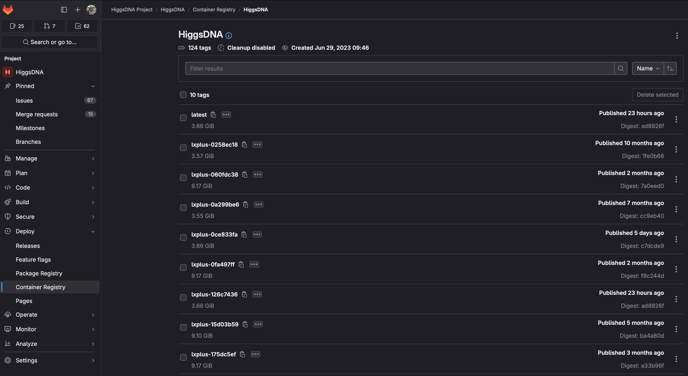

Installation
============

Standard Procedure
------------------

The standard way to get HiggsDNA up and running consists in the following steps.

After cloning the repo and accessing it with the usual::

        git clone https://gitlab.cern.ch/HiggsDNA-project/HiggsDNA.git
        cd HiggsDNA

one can create a conda environment with the main needed dependencies::

        conda env create -f environment.yml
        # if available, do it with mamba, it's much faster :)
        mamba env create -f environment.yml

        conda activate higgs-dna

To install the package in editable mode run::

        pip install -e .[dev]

Docker & Singularity
--------------------

In case you experience issues using the conda environment, docker images are available to try. These are especially useful on LXPLUS, where instead of ``docker`` the ``singularity`` command should be used (also called ``apptainer``).

Since the main goal of the Docker images to use on LXPLUS it to ease the experience of submitting jobs using Dask, the base image used is the one provided with the `dask-lxplus <https://gitlab.cern.ch/batch-team/dask-lxplus>`_ package (as can be seen in the `Dockerfile <https://gitlab.cern.ch/HiggsDNA-project/HiggsDNA/-/blob/master/Dockerfile?ref_type=heads>`_).

Docker images are built in CI every time a commit is pushed on the master branch, with the most recent one tagged as ``latest``.

If you want to use the latest image with HiggsDNA already installed in it (i.e. no development), you can pull it with::

        apptainer shell -B /afs -B /cvmfs/cms.cern.ch \
        -B /tmp  -B /eos/cms/ \
        -B /etc/sysconfig/ngbauth-submit -B ${XDG_RUNTIME_DIR} --env KRB5CCNAME="FILE:${XDG_RUNTIME_DIR}/krb5cc" \
        /cvmfs/unpacked.cern.ch/gitlab-registry.cern.ch/higgsdna-project/higgsdna:latest

If you want to also develop you can pull the same image and create a virtual environment inside it::

        # pull and access the image
        apptainer shell -B /afs -B /cvmfs/cms.cern.ch \
        -B /tmp  -B /eos/cms/ \
        -B /etc/sysconfig/ngbauth-submit -B ${XDG_RUNTIME_DIR} --env KRB5CCNAME="FILE:${XDG_RUNTIME_DIR}/krb5cc" \
        /cvmfs/unpacked.cern.ch/gitlab-registry.cern.ch/higgsdna-project/higgsdna:latest

        # create virtual environment 
        python -m venv --system-site-packages myenv

        # source environment 
        source myenv/bin/activate

You can then access your HiggsDNA repository and install it in editable mode::

        cd HiggsDNA
        pip install -e .[dev]

One known issue of this procedure is in the installation of ``xgboost``. If you see something like::
        
        xgboost.libpath.XGBoostLibraryNotFound: Cannot find XGBoost Library in the candidate path.  List of candidates:
        - /afs/cern.ch/work/g/gallim/devel/myenv/lib/libxgboost.so
        XGBoost Python package path: /usr/local/lib/python3.8/site-packages/xgboost
        sys.prefix: /afs/cern.ch/work/g/gallim/devel/myenv
        See: https://xgboost.readthedocs.io/en/latest/build.html for installing XGBoost.

if that happens, you can create a symlink to the shared library already provided in the image, e.g.::
        
        ln -s /usr/local/lib/libxgboost.so /afs/cern.ch/work/g/gallim/devel/myenv/lib/libxgboost.so

Older versions of the images are also available `here <https://hub.docker.com/repository/docker/magalli/hdna-example/general>`_.
